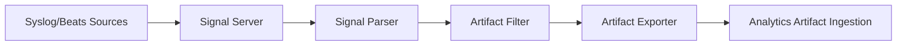

# Conductor

Conductor is WitFoo's signal pipeline for collecting, parsing, and exporting security logs to WitFoo Analytics.

## Architecture



## Services

| Service | Port | Description |
| --- | --- | --- |
| **Signal Server** | 514/udp, 514/tcp, 5044, 6514 | Receives syslog and Beats input |
| **Signal Parser** | Internal | Parses raw signals into structured data |
| **Artifact Filter** | Internal | Filters and normalizes artifacts |
| **Artifact Exporter** | Internal | Sends artifacts to Analytics via HMAC-authenticated HTTP |
| **Broker** | 4223, 8223 | NATS JetStream for inter-service messaging |

## HMAC Authentication

The Artifact Exporter authenticates with Analytics using HMAC-SHA256:

1. Body hash: `hex(SHA256(body))`
2. Message: `timestamp + "." + bodyHash`
3. Signature: `hex(HMAC-SHA256(secret, message))`

Configured via `ANALYTICS_SECRET` on both Conductor and Analytics.

## Management

### Start/Stop

```bash
# Using management script
./scripts/dev-conductor.sh start
./scripts/dev-conductor.sh stop
./scripts/dev-conductor.sh status
```

### Conductor UI

Access the Conductor UI through the Analytics reverse proxy. Requires `conductor:read` permission. The UI uses JWT auth bridge — Analytics JWT tokens are validated and mapped to Conductor roles.

## Permissions

| Permission | Access Level |
| --- | --- |
| `conductor:read` | View Conductor UI |
| `conductor:write` | Configure Conductor |
| `conductor:admin` | Full Conductor administration |
