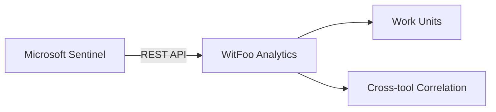

# Microsoft Sentinel

Integrate WitFoo Analytics with Microsoft Sentinel to ingest security incidents and alerts from your Azure environment.

## Overview

The Microsoft Sentinel connector pulls security incidents from your Sentinel workspace via the Azure Management REST API. Incidents are imported as work units in WitFoo Analytics, enabling correlation with data from other security tools.

## Prerequisites

- Active Azure subscription with Microsoft Sentinel enabled
- Azure App Registration with appropriate API permissions
- Sentinel workspace deployed in a resource group
- Network connectivity from WitFoo to `https://management.azure.com`

## Azure App Registration

Create an app registration in Azure AD (Entra ID) to authorize WitFoo API access.

1. Navigate to **Azure Portal** > **App registrations** > **New registration**
2. Name: `WitFoo Analytics Integration`
3. Supported account types: **Single tenant**
4. Register the application
5. Note the **Application (client) ID** and **Directory (tenant) ID**
6. Under **Certificates & secrets**, create a new client secret and note the value

### Required API Permissions

| Permission | Type | Description |
| --- | --- | --- |
| **SecurityIncident.Read.All** | Application | Read security incidents from Sentinel |

!!! note "Admin Consent"
    An Azure AD administrator must grant admin consent for application permissions after they are added.

### Role Assignment

The app registration also needs the **Microsoft Sentinel Reader** role on the Sentinel workspace:

1. Navigate to your Sentinel **workspace** > **Access control (IAM)**
2. Add role assignment: **Microsoft Sentinel Reader**
3. Assign to the app registration created above

## Configuration

Navigate to **Admin** > **Settings** > **Connectors** > **Microsoft Sentinel** in WitFoo Analytics.

### Settings

| Setting | Description | Example |
| --- | --- | --- |
| **Tenant ID** | Azure AD directory (tenant) ID | `a1b2c3d4-e5f6-...` |
| **Client ID** | Application (client) ID from app registration | `f6e5d4c3-b2a1-...` |
| **Client Secret** | Client secret value (encrypted at rest) | `***` |
| **Subscription ID** | Azure subscription containing the Sentinel workspace | `12345678-abcd-...` |
| **Resource Group** | Resource group name where Sentinel is deployed | `rg-security-prod` |
| **Workspace Name** | Log Analytics workspace name for Sentinel | `sentinel-workspace` |

!!! warning "Secret Rotation"
    Azure client secrets expire. Set a reminder to rotate the secret before expiry and update the value in WitFoo settings.

## Connection Testing

After entering all configuration values, use the **Test Connection** button to validate:

1. **Authentication** -- Confirms the client credentials can obtain an OAuth2 token from Azure AD
2. **Workspace Access** -- Verifies the app registration can reach the specified Sentinel workspace
3. **Incident Read** -- Attempts to list recent incidents to confirm permissions

A successful test returns a green status indicator. If the test fails, review the error message for guidance on which setting needs correction.

## Data Flow

Incidents are polled at a configurable interval (default: 5 minutes). Each Sentinel incident maps to a WitFoo work unit with:

- Severity mapping (High/Medium/Low/Informational)
- Incident timeline and alerts
- Entity extraction (IPs, users, hosts)
- Status synchronization
