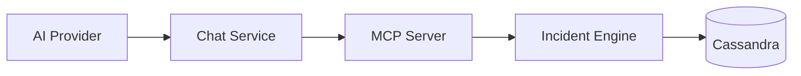

# MCP Architecture

The MCP server runs as part of the Incident Engine service, providing tool access to AI models through the standardized MCP protocol.

## Integration

1. User sends a message through the chat interface
2. The chat service forwards the message to the AI provider with MCP tool definitions
3. The AI model decides which tools to invoke
4. Tool calls are executed against the Incident Engine API
5. Results are returned to the AI for response generation

## Tool Categories

| Category | Examples |
| --- | --- |
| **Search** | Search artifacts, nodes, incidents |
| **Analysis** | Get incident details, node relationships |
| **Reports** | Retrieve report data and metrics |
| **Configuration** | Read system settings |

## Security Model

All MCP tool invocations respect the user's permissions. A tool call is rejected if the user lacks the required permission for the underlying API endpoint.
