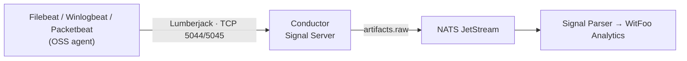

---
tags:
  - conductor
  - integration
  - beats
---

# Log Shippers (Elastic Beats — OSS)

WitFoo Conductor accepts data from the **open source (OSS) editions of Elastic
Beats** — Filebeat, Winlogbeat, and Packetbeat — as a **push-based** log
source. The agents run on your endpoints and servers and stream events to the
Conductor [Signal Server](../signal-server.md) using the **Lumberjack
protocol** (the same wire protocol the Beats *Logstash output* speaks) on
**TCP 5044 / 5045**.

This is different from the [pull-based API integrations](../integrations/index.md),
where the Signal Client polls a vendor API. With Beats, the agent connects
outbound to Conductor and pushes events as they are collected.



!!! warning "Use the OSS (Apache 2.0) builds only"
    Elastic ships two distributions of Beats: the default distribution (Elastic
    License) and the **OSS distribution** (Apache License 2.0). WitFoo
    deployments standardize on the **OSS** builds.

    Elastic stopped publishing OSS artifacts **after the 7.x line** — there are
    **no `-oss` builds for 8.x or 9.x**. The final OSS release line is
    **7.17.x** (examples on these pages use `7.17.29`; substitute the latest
    `7.17.x` patch). Always install the package whose name ends in `-oss`
    (`filebeat-oss`, `winlogbeat-oss`, `packetbeat-oss`) or download an artifact
    with `-oss-` in the filename.

## Available Guides

| Beat | Collects | Platforms | Guide |
|---|---|---|---|
| Filebeat (OSS) | Log files (syslog, app logs, `auth.log`, NDJSON, etc.) | Linux, Windows | [Configure →](filebeat.md) |
| Winlogbeat (OSS) | Windows Event Logs (Security, System, Sysmon) | Windows | [Configure →](winlogbeat.md) |
| Packetbeat (OSS) | Network metadata (DNS, HTTP, TLS, flows) | Linux, Windows | [Configure →](packetbeat.md) |

## Step 1 — Enable the Beats listener in Conductor

The Beats/Logstash listener is managed on the
[Log Server Configuration](../ui/log-servers.md) page. It must be enabled before
agents can connect:

1. Open the **Conductor UI** → **Admin** → **Settings** → **Log Servers**
2. Enable the **Beats/Logstash** connector (ports **5044–5045**)
3. The change is saved to the NATS KV `SERVERS` bucket and the Signal Server
   begins listening within seconds — no container restart required

!!! info "Two ports, one protocol"
    Ports **5044** and **5045** both run the Lumberjack framer. Use either one,
    or list both in your Beat output with `loadbalance: true` to spread
    connections across them.

## Step 2 — Install the OSS build

The OSS packages are published from a dedicated Elastic `oss-7.x` repository and
as standalone artifacts. Per-OS install commands are on each Beat's guide; the
repository setup below is shared by Filebeat and Packetbeat on Linux.
(Winlogbeat is Windows-only and is installed from the OSS `.zip`.)

=== "Debian / Ubuntu (APT)"

    ```bash
    # Import the Elastic signing key
    wget -qO - https://artifacts.elastic.co/GPG-KEY-elasticsearch \
      | sudo gpg --dearmor -o /usr/share/keyrings/elastic-7.x.gpg

    # Add the OSS 7.x repository (Apache 2.0 builds only)
    echo "deb [signed-by=/usr/share/keyrings/elastic-7.x.gpg] https://artifacts.elastic.co/packages/oss-7.x/apt stable main" \
      | sudo tee /etc/apt/sources.list.d/elastic-oss-7.x.list

    sudo apt-get update
    # then: sudo apt-get install filebeat-oss   (or packetbeat-oss)
    ```

=== "RHEL / CentOS (YUM)"

    ```bash
    sudo rpm --import https://artifacts.elastic.co/GPG-KEY-elasticsearch

    sudo tee /etc/yum.repos.d/elastic-oss-7.x.repo > /dev/null <<'EOF'
    [elastic-oss-7.x]
    name=Elastic OSS repository for 7.x packages
    baseurl=https://artifacts.elastic.co/packages/oss-7.x/yum
    gpgcheck=1
    gpgkey=https://artifacts.elastic.co/GPG-KEY-elasticsearch
    enabled=1
    autorefresh=1
    type=rpm-md
    EOF

    # then: sudo yum install filebeat-oss   (or packetbeat-oss)
    ```

=== "Standalone artifact"

    Download a specific `-oss` build directly (no repository required). See each
    Beat's guide for the exact filename, e.g.:

    ```bash
    https://artifacts.elastic.co/downloads/beats/filebeat/filebeat-oss-7.17.29-amd64.deb
    ```

## Step 3 — Point the output at Conductor

Every Beat ships to Conductor through the **`output.logstash`** block. Conductor
is *not* Logstash, but its Signal Server implements the same Lumberjack
protocol, so this is the correct output type:

```yaml
output.logstash:
  hosts: ["<conductor-host>:5044"]
  # Load-balance across both listeners (optional):
  # hosts: ["<conductor-host>:5044", "<conductor-host>:5045"]
  # loadbalance: true

# Not shipping to Elasticsearch/Kibana — skip their setup paths.
setup.template.enabled: false
setup.ilm.enabled: false
setup.dashboards.enabled: false
```

!!! note "Transport security (TLS)"
    The Beats listeners follow the Signal Server's TLS setting:

    - **TLS disabled** (default on many appliances): the listener accepts plain
      TCP — use the configuration above with no `ssl` block.
    - **TLS enabled** (`disable_tls: false` on the node): the listener presents
      the appliance's server certificate (self-signed by default), so the Beat
      must connect with SSL:

    ```yaml
    output.logstash:
      hosts: ["<conductor-host>:5044"]
      ssl.enabled: true
      # The appliance uses a self-signed certificate by default:
      ssl.verification_mode: none
      # Preferred: pin the appliance CA instead of disabling verification:
      # ssl.certificate_authorities: ["/etc/filebeat/conductor-ca.crt"]
    ```

    Match the output to the node's setting — a TLS/plain mismatch shows up as a
    handshake error or an immediately dropped connection.

## Step 4 — Validate data flow

1. **Validate the agent config locally** (each Beat supports this):

    ```bash
    sudo filebeat test config -e        # syntax check
    sudo filebeat test output -e        # connectivity to Conductor:5044
    ```

2. **Confirm Conductor is receiving** — on the Conductor host:

    ```bash
    docker logs signal-server-svc --tail=50
    ```

3. **Search in WitFoo Analytics** — open **Signals → Search** and look for
   artifacts from the agent's host. Filebeat/Winlogbeat events are
   auto-detected as Beats formats by the pipeline; Packetbeat flows arrive as
   Beats JSON.

## Troubleshooting

### Connection refused / nothing arrives

- Confirm the **Beats/Logstash** connector is **enabled** in
  [Log Servers](../ui/log-servers.md) (Step 1).
- Verify the agent can reach the Conductor host on TCP 5044/5045
  (firewall / security group).
- Run `<beat> test output -e` on the agent — it reports the exact failure.

### TLS handshake error

- The node has TLS enabled but the Beat output has no `ssl` block (or vice
  versa). Align them (see the TLS note above). For a self-signed appliance
  certificate, set `ssl.verification_mode: none` or pin the CA.

### Confirm you installed the OSS build

- The package name must end in `-oss`, or the artifact filename must contain
  `-oss-`. OSS builds exclude X-Pack; the `output.logstash` path and all core
  inputs used here are fully present.

---

*See also: [Signal Server](../signal-server.md) ·
[Log Server Configuration](../ui/log-servers.md) ·
[Common Troubleshooting](../integrations/common-troubleshooting.md)*
