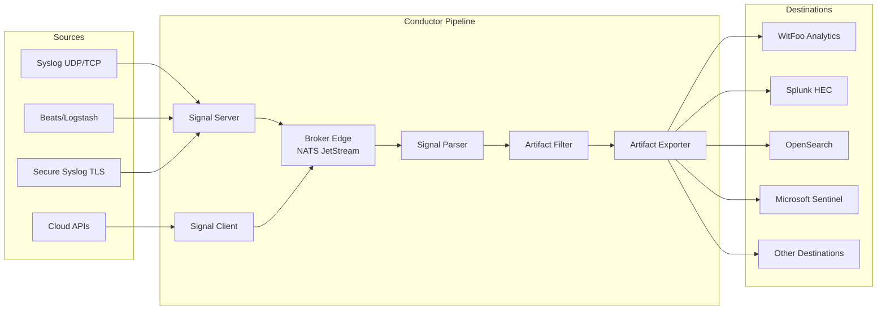

# WitFoo Conductor Overview

WitFoo Conductor is a high-performance security signal processing pipeline that serves as the primary data ingestion point for the WitFoo Analytics platform. Conductor collects, parses, filters, and exports security log data from hundreds of sources, transforming raw signals into structured, actionable artifacts.

## Architecture

Conductor follows a microservice architecture where all inter-service communication flows through a NATS JetStream message broker. Data moves through a linear pipeline: ingestion → parsing → filtering → export.

## Service Map

Conductor consists of 7 core services, each running as an independent Docker container managed by the WFA (WitFoo Agent) daemon:

| Service | Container Name | Purpose | Ports |
|---------|---------------|---------|-------|
| [Broker Edge](broker-edge.md) | `broker-edge-svc` | NATS JetStream message broker | 4223, 4443, 8223 |
| [Signal Server](signal-server.md) | `signal-server-svc` | Push-based log ingestion | 514, 5044-5045, 6514, 7514 |
| [Signal Client](signal-client.md) | `signal-client-svc` | Pull-based API log collection | — |
| [Signal Parser](signal-parser.md) | `signal-parser-svc` | Log parsing and normalization | — |
| [Artifact Filter](artifact-filter.md) | `artifact-filter-svc` | Deduplication and enrichment | — |
| [Artifact Exporter](artifact-exporter.md) | `artifact-exporter-svc` | Export to external systems | — |
| [Conductor UI](ui/index.md) | `conductor-ui-svc` | Web management interface | 443 (8000 internal) |

## Key Features

- **200+ Log Parsers** — Comprehensive coverage for firewalls, IDS/IPS, authentication systems, DNS, cloud platforms, endpoints, email security, and network infrastructure
- **39 API Integrations** — Pull-based collection from Microsoft, Cisco, CrowdStrike, Palo Alto, Proofpoint, Okta, and [many more](integrations/index.md)
- **8 Export Destinations** — Splunk HEC, OpenSearch, Microsoft Sentinel, AlienVault, SCP Transfer, UDP Syslog, Local FileSystem, and WitFoo Analytics Reporter
- **Real-Time Dashboard** — WebSocket-driven monitoring with pipeline throughput, service health, and container metrics
- **ProtoGraph Deduplication** — 11-tuple artifact matching reduces noise while preserving security-relevant event variations
- **STIX Enrichment** — Optional threat intelligence enrichment from STIX feeds
- **High Throughput** — Sustained processing at >2000 messages per second with optimized serial parser pipeline

## Deployment Model

Conductor is deployed as a **WitFoo Appliance** — a dedicated Linux server (physical or virtual) running the WFA daemon. WFA manages the complete container lifecycle: pulling images, creating containers, starting services in dependency order, and handling updates.

!!! note "Minimum Hardware Requirements"
    Conductor requires a minimum of **4 CPU cores** and **8 GB RAM**. The `wfa configure` wizard will warn if the system does not meet these requirements.

For deployment instructions, see the [Deployment Guide](deployment.md). For CLI management, see the [WFA CLI Reference](wfa-cli.md).