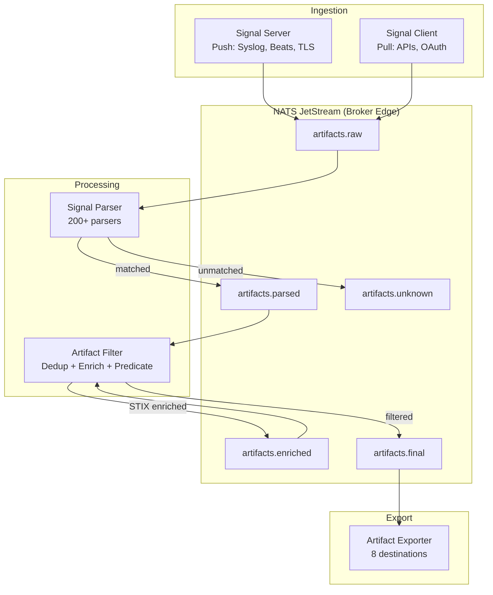

# Signal Processing Pipeline

The Conductor pipeline transforms raw log data into structured, export-ready security artifacts through four stages: ingestion, parsing, filtering, and export. All inter-service communication uses NATS JetStream for reliable, persistent message delivery.

## End-to-End Data Flow



## NATS JetStream Streams

All pipeline data flows through the **DATA** stream using a hierarchical subject pattern:

```
{applianceID}.data.artifacts.{stage}
```

| Subject | Stage | Publisher | Consumer | Description |
|---------|-------|-----------|----------|-------------|
| `artifacts.raw` | Ingestion | signal-server, signal-client | signal-parser | Raw log messages as received |
| `artifacts.parsed` | Parsing | signal-parser | artifact-filter | Successfully parsed and structured artifacts |
| `artifacts.unknown` | Parsing | signal-parser | Monitoring only | Messages no parser could match |
| `artifacts.enriched` | Enrichment | artifact-filter | artifact-filter | Artifacts with STIX threat intelligence added |
| `artifacts.final` | Filtering | artifact-filter | artifact-exporter | Export-ready artifacts after deduplication and filtering |

Additional streams support operational functions:

| Stream | Purpose |
|--------|---------|
| `EVENTS` | System events and status updates |
| `LOGS` | Centralized service log collection |
| `METRICS` | Pipeline metrics in Prometheus format |
| `STATUSES` | Service health and status reports |

## Pipeline Stages

### Stage 1: Ingestion

Two services handle data ingestion using complementary models:

- **Signal Server** (push) — Listens for incoming network connections on syslog, Beats, and HTTP protocols. Buffers incoming data and publishes to `artifacts.raw`.
- **Signal Client** (pull) — Polls external APIs on configurable schedules using OAuth and API key authentication. Publishes collected events to `artifacts.raw`.

### Stage 2: Parsing

The **Signal Parser** consumes from `artifacts.raw` and runs each message through a three-stage internal pipeline:

1. **Format Detection** — Identifies the log format (RFC3164, RFC5424, CEF, LEEF, JSON, Zeek) and extracts standard headers
2. **Parser Matching** — Runs the message through 200+ parsers using fingerprint-based early exit optimization. The first parser whose fingerprint matches processes the message.
3. **Output Routing** — Successfully parsed artifacts publish to `artifacts.parsed`; unmatched messages route to `artifacts.unknown`

!!! info "Throughput Characteristics"
    The serial parser pipeline processes >2000 messages per second with 200+ active parsers. Optimized parsers achieve <2ms per message. The early exit pattern means most messages only test a few fingerprints before finding a match.

### Stage 3: Filtering

The **Artifact Filter** applies three processing steps:

1. **ProtoGraph Deduplication** — Reduces redundant events using an 11-tuple hash (SenderHost, ClientIP, ServerIP, ServerPort, Protocol, UserName, FileName, StreamName, MessageType, Action, SeverityLabel)
2. **STIX Enrichment** (optional) — Checks IPs, domains, and hashes against threat intelligence feeds
3. **Predicate Filtering** — Applies rule-based inclusion/exclusion filters

### Stage 4: Export

The **Artifact Exporter** consumes from `artifacts.final` and delivers artifacts to one or more configured destinations with batching, retry logic, and connector-specific formatting.

## Source → Flow → Sink Pattern

All pipeline services follow a consistent architectural pattern from the shared `common` library:

| Component | Role | Example |
|-----------|------|---------|
| **Source** | Extract data from an input | NATS consumer, TCP listener, API poller |
| **Flow** | Transform data | Parse, filter, enrich, format |
| **Sink** | Load data to an output | NATS publisher, HTTP POST, file write |

Each service implements the `module.Connector` interface with `Setup()` for configuration and `Start()` for the processing loop. Configuration is delivered at runtime via NATS KV buckets, enabling dynamic reconfiguration without container restarts.