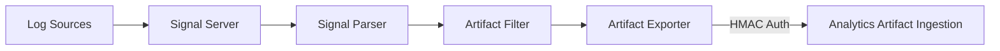

# Conductor Deployment

Deploy the Conductor signal pipeline alongside WitFoo Analytics for log collection.

## Architecture

Conductor runs as a separate Docker Compose stack connected to Analytics via an external Docker network.



## Prerequisites

- WitFoo Analytics running with `witfoo-analytics-net` Docker network
- Conductor binaries built via `scripts/conductor-build.sh`

## Deployment

```bash
# Build Conductor binaries
./scripts/conductor-build.sh

# Start Conductor services
./scripts/dev-conductor.sh start

# Verify status
./scripts/dev-conductor.sh status
```

## Services

| Service | Ports | Description |
| --- | --- | --- |
| **broker-edge** | 4223, 8223 | NATS JetStream broker |
| **signal-server** | 514/udp, 514/tcp, 5044, 6514 | Log receiver |
| **signal-parser** | Internal | Signal parsing |
| **artifact-filter** | Internal | Artifact filtering |
| **artifact-exporter** | Internal | HTTP export to Analytics |

## HMAC Authentication

Configure the shared secret in both stacks:

```bash
# Analytics docker/.env
ANALYTICS_SECRET=your-shared-secret

# Conductor config
# Same secret in conductor-node.json
```

## Docker Network

Both stacks share an external network:

```bash
docker network create witfoo-analytics-net
```

## Next Steps

After deployment, configure your data source integrations:

- [Integration Enablement Guides](../conductor/integrations/index.md) — Step-by-step setup for 39 supported integrations
- [Signal Client](../conductor/signal-client.md) — API-based signal collection architecture
- [Conductor Troubleshooting](../conductor/troubleshooting.md) — Common issues and diagnostics
