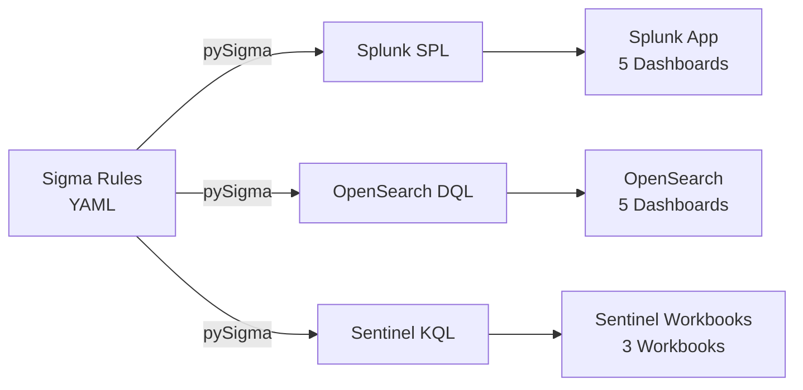

# Detection Rules

WitFoo provides a comprehensive library of **68 detection rules** written in the
[Sigma](https://sigmahq.io/) format — an open, platform-agnostic detection rule
language. These rules are automatically converted to native query languages for
three major SIEM platforms.

## Overview

| Component | Count | Description |
|-----------|-------|-------------|
| Sigma Detection Rules | 55 | Platform-agnostic detection logic |
| Sigma Correlation Rules | 8 | Multi-event behavioral detections |
| Sigma Filter Rules | 5 | Noise reduction and tuning |
| Splunk SPL Queries | 55 | Converted for Splunk Enterprise |
| OpenSearch DQL Queries | 55 | Converted for OpenSearch / Elasticsearch |
| Sentinel KQL Queries | 55 | Converted for Microsoft Sentinel |
| Platform Dashboards | 13 | 5 Splunk + 5 OpenSearch + 3 Sentinel |

## Rule Categories

Rules are organized into **9 security domains**, each targeting specific threat
vectors and telemetry types from WitFoo's artifact-exporter service.

| Category | Rules | Focus Area |
|----------|-------|------------|
| [Network Security](rules/network.md) | 12 | Traffic anomalies, tunneling, beaconing |
| [Authentication](rules/authentication.md) | 8 | Brute force, credential stuffing, MFA bypass |
| [Malware](rules/malware.md) | 8 | C2 detection, ransomware indicators, persistence |
| [Data Loss Prevention](rules/data-loss.md) | 6 | Exfiltration, large transfers, policy violations |
| [Cloud Security](rules/cloud.md) | 6 | Misconfiguration, privilege escalation, API abuse |
| [Compliance](rules/compliance.md) | 5 | Policy violations, unencrypted traffic, retention |
| [Infrastructure](rules/infrastructure.md) | 5 | Service health, certificate issues, config drift |
| [IDS/IPS](rules/ids.md) | 5 | Signature-based alerts, evasion attempts |
| [Correlations](rules/correlations.md) | 8 | Multi-event behavioral detections |
| [Filters](rules/filters.md) | 5 | Noise reduction and tuning |

## Platform Integration

All rules use field names from WitFoo's **artifact-exporter** service, which
exports normalized security telemetry in a consistent JSON format. The same
camelCase field names (`clientIP`, `serverIP`, `totalBytes`, `streamName`, etc.)
are sent to all SIEM targets, so rules require no field mapping.



## Quick Start

### Import to Splunk

1. Copy the `splunk/witfoo_siem_app/` directory to `$SPLUNK_HOME/etc/apps/`
2. Restart Splunk
3. Enable desired saved searches in **Settings → Searches, Reports, and Alerts**

### Import to OpenSearch

1. Apply the index template: **Dev Tools → `PUT _index_template/witfoo`** with `index_template.json`
2. Import dashboards: **Stack Management → Saved Objects → Import** each `.ndjson` file
3. Verify the `witfoo-*` index pattern appears

### Import to Microsoft Sentinel

1. Deploy workbooks: **Azure Portal → Sentinel → Workbooks → Add workbook → Advanced Editor** and paste the ARM JSON
2. Deploy analytics rules: **Azure Portal → Deploy a custom template** with `analytics_rules.json`
3. Enable desired rules in **Analytics → Active rules**

## Conversion Pipeline

Rules are maintained as Sigma YAML and converted using pySigma with custom
WitFoo processing pipelines.

```bash
# Convert to all platforms
cd utils/sigma-converter
make all

# Convert for a single platform
make splunk
make opensearch
make sentinel

# Validate without writing files
python convert.py --target all --validate-only

# Run tests
make test
```

## Testing

The rule library includes comprehensive automated tests:

```bash
cd utils/sigma-converter

# Rule structure and field validation (860 tests)
pytest test_rules.py

# Conversion pipeline tests (19 tests)
pytest test_convert.py

# Dashboard structure tests (86 tests)
pytest test_dashboards.py

# All tests together (965 tests)
pytest test_rules.py test_convert.py test_dashboards.py
```
