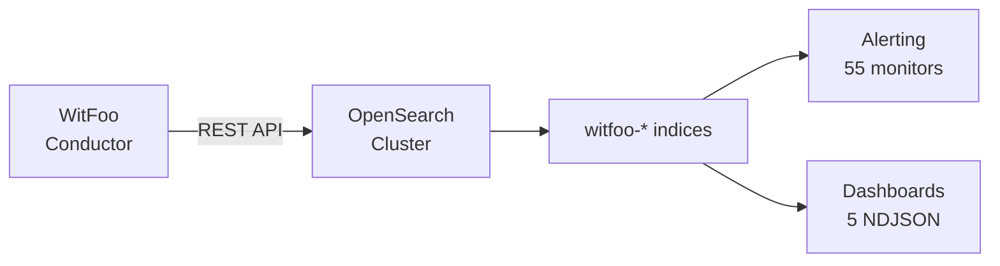

# OpenSearch Integration

Deploy WitFoo detection rules and dashboards to OpenSearch or OpenSearch Dashboards.

## Prerequisites

- OpenSearch 2.x+ with OpenSearch Dashboards
- WitFoo Conductor with artifact-exporter configured to send to OpenSearch
- Admin access to manage index templates and saved objects

## Architecture



The artifact-exporter sends JSON documents to OpenSearch indices matching the
`witfoo-*` pattern (e.g., `witfoo-2026.02.21`). All fields use camelCase naming.

## Step 1: Apply Index Template

Apply the index template to ensure correct field mappings:

=== "Dev Tools"

    ```json
    PUT _index_template/witfoo
    // Paste contents of opensearch/index_template.json
    ```

=== "curl"

    ```bash
    curl -X PUT "https://opensearch:9200/_index_template/witfoo" \
      -H "Content-Type: application/json" \
      -d @opensearch/index_template.json
    ```

The template maps key fields with appropriate types:

- `clientIP`, `serverIP` → `ip` type (enables CIDR queries)
- `totalBytes`, `clientBytes`, `serverBytes` → `long` type
- `startTimeUTC` → `date` type (used as time field)
- `streamName`, `severity` → `keyword` type
- `artifactName` → `text` + `keyword` (full-text + exact match)

## Step 2: Import Dashboards

Import the 5 NDJSON dashboard files via OpenSearch Dashboards:

1. Navigate to **Stack Management → Saved Objects**
2. Click **Import**
3. Select each `.ndjson` file from `opensearch/dashboards/`:

| Dashboard File | Panels | Description |
|---------------|--------|-------------|
| `witfoo_network_overview.ndjson` | 8 | Traffic volume, top IPs, protocols, geo |
| `witfoo_security_alerts.ndjson` | 7 | Alert timeline, severity, ATT&CK techniques |
| `witfoo_attack_coverage.ndjson` | 6 | Technique count, tactic distribution |
| `witfoo_top_talkers.ndjson` | 6 | Bandwidth consumers, user sessions |
| `witfoo_protocol_analysis.ndjson` | 5 | Protocol breakdown, encrypted vs cleartext |

Each NDJSON file includes:

- An index pattern for `witfoo-*`
- The dashboard saved object
- All visualization saved objects referenced by the dashboard

!!! note "Index Pattern"
    If you already have a `witfoo-*` index pattern, choose **Check for existing
    objects** during import to avoid duplicates.

## Step 3: Create Alerting Monitors

Convert the 55 DQL rule files into OpenSearch alerting monitors:

=== "Manual"

    1. Navigate to **Alerting → Monitors → Create monitor**
    2. Choose **Per query monitor** → **Extraction query**
    3. Set Index to `witfoo-*`
    4. Paste the DQL query from any `.dql` file in `opensearch/rules/`
    5. Configure trigger threshold and notification channel

=== "Bulk API"

    ```bash
    # Example: create a monitor from a DQL file
    for f in opensearch/rules/*.dql; do
      NAME=$(basename "$f" .dql)
      QUERY=$(cat "$f")
      curl -X POST "https://opensearch:9200/_plugins/_alerting/monitors" \
        -H "Content-Type: application/json" \
        -d "{
          \"name\": \"WitFoo - $NAME\",
          \"type\": \"monitor\",
          \"enabled\": false,
          \"schedule\": {\"period\": {\"interval\": 15, \"unit\": \"MINUTES\"}},
          \"inputs\": [{\"search\": {\"indices\": [\"witfoo-*\"], \"query\": {\"query_string\": {\"query\": \"$QUERY\"}}}}],
          \"triggers\": [{\"name\": \"Alert\", \"severity\": \"3\", \"condition\": {\"script\": {\"source\": \"ctx.results[0].hits.total.value > 0\"}}}]
        }"
    done
    ```

## Field Reference

| Field | OpenSearch Type | Description |
|-------|----------------|-------------|
| `clientIP` | `ip` | Source/client IP |
| `serverIP` | `ip` | Destination/server IP |
| `serverPort` | `integer` | Destination port |
| `protocol` | `keyword` | Network protocol |
| `totalBytes` | `long` | Total bytes transferred |
| `streamName` | `keyword` | WitFoo stream classification |
| `severity` | `keyword` | Alert severity |
| `leadRuleIDs` | `integer` (array) | Triggered lead rule IDs |
| `attackTechniqueIDs` | `keyword` (array) | ATT&CK technique IDs |
| `startTimeUTC` | `date` | Event timestamp |

## Troubleshooting

!!! warning "No Data in Dashboards"
    Check that documents are flowing to the `witfoo-*` index:
    ```
    GET witfoo-*/_count
    ```
    If count is 0, verify the artifact-exporter endpoint and authentication.

!!! warning "Field Type Conflicts"
    If the index template was applied after data was already indexed, existing
    indices keep their original mapping. Reindex or wait for new index rotation.

!!! tip "Performance"
    For high-volume environments, consider:

    - Increasing shard count in the index template
    - Using ISM policies for index lifecycle management
    - Adding `startTimeUTC` as the sort field for time-based queries
