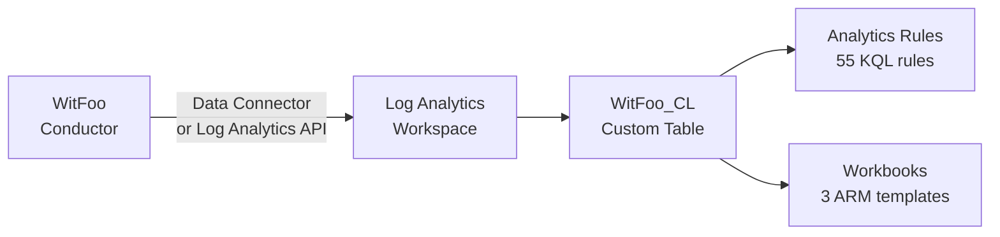

# Microsoft Sentinel Integration

Deploy WitFoo detection rules and dashboards to Microsoft Sentinel using ARM
templates.

## Prerequisites

- Microsoft Sentinel workspace (Log Analytics)
- WitFoo Conductor with artifact-exporter configured to send to Sentinel
- Azure CLI or portal access with Contributor role on the resource group
- Data flowing to `WitFoo_CL` custom log table

## Architecture



The artifact-exporter sends events to a Log Analytics workspace. Sentinel
applies the `_CL` suffix to the custom table and field suffixes based on type:
`_s` (string), `_d` (double), `_t` (datetime), `_b` (boolean).

## Step 1: Deploy Analytics Rules

The 55 scheduled analytics rules are packaged as a single ARM template.

=== "Azure CLI"

    ```bash
    az deployment group create \
      --resource-group <your-rg> \
      --template-file sentinel/analytics_rules.json \
      --parameters workspaceName=<your-workspace>
    ```

=== "Azure Portal"

    1. Navigate to **Deploy a custom template**
    2. Click **Build your own template in the editor**
    3. Paste contents of `sentinel/analytics_rules.json`
    4. Set `workspaceName` parameter to your Sentinel workspace name
    5. Select your subscription and resource group
    6. Click **Review + create**

=== "PowerShell"

    ```powershell
    New-AzResourceGroupDeployment `
      -ResourceGroupName <your-rg> `
      -TemplateFile sentinel/analytics_rules.json `
      -workspaceName <your-workspace>
    ```

All 55 rules are deployed **disabled** by default. Enable rules individually:

1. Navigate to **Sentinel → Analytics → Active rules**
2. Filter by prefix `WitFoo -`
3. Select rules to enable → **Enable**

### Rule Properties

| Property | Value |
|----------|-------|
| Type | Scheduled |
| Frequency | 15 minutes |
| Lookback | 15 minutes |
| Status | Disabled (default) |
| Entity mapping | IP entities for `clientIP_s`, `serverIP_s` |

## Step 2: Deploy Workbooks

Three workbooks provide operational dashboards:

| Workbook | KQL Queries | Description |
|----------|-------------|-------------|
| `witfoo_network_overview.json` | 8 | Traffic volume, top IPs, protocols, geo regions |
| `witfoo_security_alerts.json` | 7 | Alert timeline, severity distribution, ATT&CK mapping |
| `witfoo_attack_coverage.json` | 7 | Coverage metrics, tactic distribution, technique trends |

Deploy each workbook:

=== "Azure CLI"

    ```bash
    az deployment group create \
      --resource-group <your-rg> \
      --template-file sentinel/workbooks/witfoo_network_overview.json \
      --parameters workspaceName=<your-workspace>

    az deployment group create \
      --resource-group <your-rg> \
      --template-file sentinel/workbooks/witfoo_security_alerts.json \
      --parameters workspaceName=<your-workspace>

    az deployment group create \
      --resource-group <your-rg> \
      --template-file sentinel/workbooks/witfoo_attack_coverage.json \
      --parameters workspaceName=<your-workspace>
    ```

=== "Azure Portal"

    1. Navigate to **Sentinel → Workbooks → Templates**
    2. Click **Add workbook** → **Advanced Editor**
    3. Paste the ARM template JSON
    4. Set `workspaceName` parameter
    5. Click **Apply** → **Done Editing** → **Save**

## KQL Field Naming

Sentinel appends type suffixes to custom log fields. Map WitFoo's camelCase
fields to their Sentinel equivalents:

| WitFoo Field | Sentinel Column | Type |
|--------------|-----------------|------|
| `clientIP` | `clientIP_s` | string |
| `serverIP` | `serverIP_s` | string |
| `serverPort` | `serverPort_d` | double |
| `protocol` | `protocol_s` | string |
| `totalBytes` | `totalBytes_d` | double |
| `clientBytes` | `clientBytes_d` | double |
| `serverBytes` | `serverBytes_d` | double |
| `streamName` | `streamName_s` | string |
| `severity` | `severity_s` | string |
| `leadRuleIDs` | `leadRuleIDs_s` | string (JSON array) |
| `attackTechniqueIDs` | `attackTechniqueIDs_s` | string (JSON array) |
| `startTimeUTC` | `TimeGenerated` | datetime |
| `artifactName` | `artifactName_s` | string |
| `userName` | `userName_s` | string |
| `eventAction` | `eventAction_s` | string |

!!! note "Array Fields"
    Fields like `leadRuleIDs` and `attackTechniqueIDs` are stored as JSON
    strings in Sentinel. Use `mv-expand` or `parse_json()` in KQL:
    ```kql
    WitFoo_CL
    | extend techniques = parse_json(attackTechniqueIDs_s)
    | mv-expand techniques
    | summarize count() by tostring(techniques)
    ```

## KQL Query Examples

### Recent High-Severity Alerts

```kql
WitFoo_CL
| where severity_s in ("high", "critical")
| where TimeGenerated > ago(1h)
| project TimeGenerated, streamName_s, clientIP_s, serverIP_s, severity_s, artifactName_s
| order by TimeGenerated desc
| take 100
```

### Top ATT&CK Techniques

```kql
WitFoo_CL
| where isnotempty(attackTechniqueIDs_s)
| extend techniques = parse_json(attackTechniqueIDs_s)
| mv-expand techniques
| summarize count() by tostring(techniques)
| order by count_ desc
| take 25
```

### Network Traffic by Protocol

```kql
WitFoo_CL
| where isnotempty(protocol_s)
| summarize
    TotalBytes = sum(totalBytes_d),
    Connections = count()
    by protocol_s
| order by TotalBytes desc
```

## Troubleshooting

!!! warning "No Data in WitFoo_CL"
    Verify data ingestion:
    ```kql
    WitFoo_CL
    | take 10
    ```
    If empty, check:

    - Artifact-exporter configuration in Conductor
    - Data connector status in Sentinel
    - Log Analytics workspace ID and key

!!! warning "ARM Deployment Fails"
    Common issues:

    - **Invalid workspace name**: Must match the exact Log Analytics workspace
      name, not the Sentinel display name
    - **Permission error**: Ensure Contributor role on the resource group
    - **API version mismatch**: The templates use `2022-11-01-preview` for
      analytics rules and `2022-04-01` for workbooks

!!! tip "Cost Optimization"
    - Start with rules disabled and enable based on relevance
    - Use Analytics rule **grouping** to batch related alerts into single incidents
    - Set **entity mapping** to correlate alerts by IP address across rules
    - Consider **Basic Logs** tier for high-volume, low-priority streams
