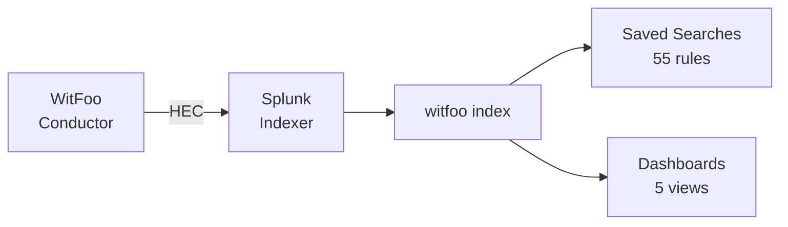

# Splunk Integration

Deploy WitFoo detection rules and dashboards to Splunk Enterprise or Splunk Cloud.

## Prerequisites

- Splunk Enterprise 8.x+ or Splunk Cloud
- WitFoo Conductor with artifact-exporter configured to send to Splunk via HEC
- Admin access to install apps and create saved searches

## Architecture



The artifact-exporter sends JSON events to Splunk's HTTP Event Collector (HEC).
Events land in the `witfoo` index with sourcetype `witfoo:artifact`. All fields
use camelCase naming from the artifact-exporter schema.

## Install the WitFoo SIEM App

### Option 1: Copy to Apps Directory

```bash
# Copy the app directory
cp -r splunk/witfoo_siem_app/ $SPLUNK_HOME/etc/apps/witfoo_siem_app/

# Restart Splunk
$SPLUNK_HOME/bin/splunk restart
```

### Option 2: Package as .tgz

```bash
# Create a Splunk app package
tar -czf witfoo_siem_app.tgz -C splunk/ witfoo_siem_app/

# Install via Splunk CLI
$SPLUNK_HOME/bin/splunk install app witfoo_siem_app.tgz -auth admin:changeme
```

## App Contents

### Dashboards (5)

| Dashboard | Panels | Description |
|-----------|--------|-------------|
| Network Overview | 8 | Traffic volume, top IPs, protocol distribution, geo regions |
| Security Alerts | 7 | Alert timeline, severity distribution, ATT&CK techniques |
| ATT&CK Coverage | 6 | Technique count, tactic distribution, coverage trend |
| Top Talkers | 6 | Bandwidth consumers, src-dst pairs, user sessions |
| Protocol Analysis | 5 | Protocol breakdown, port usage, encrypted vs cleartext |

### Saved Searches (55)

All 55 detection rules are deployed as saved searches. They are **disabled by
default** — enable the ones relevant to your environment.

```ini
# Example saved search structure
[WitFoo - DNS Tunneling Detection]
search = index=witfoo sourcetype="witfoo:artifact" | spath ...
disabled = 1
cron_schedule = */15 * * * *
dispatch.earliest_time = -15m
dispatch.latest_time = now
```

To enable a saved search:

1. **Settings → Searches, Reports, and Alerts**
2. Find the search prefixed with "WitFoo - "
3. Click **Edit → Enable**

### Index Configuration

Create the `witfoo` index if it doesn't exist:

```ini
# indexes.conf
[witfoo]
homePath = $SPLUNK_DB/witfoo/db
coldPath = $SPLUNK_DB/witfoo/colddb
thawedPath = $SPLUNK_DB/witfoo/thaweddb
maxTotalDataSizeMB = 512000
frozenTimePeriodInSecs = 7776000
```

### HEC Token Setup

```ini
# inputs.conf
[http://witfoo-artifacts]
disabled = 0
token = <your-hec-token>
index = witfoo
sourcetype = witfoo:artifact
```

## Field Reference

All queries use `| spath` to extract JSON fields. Key fields:

| Field | Type | Description |
|-------|------|-------------|
| `clientIP` | IP | Source/client IP address |
| `serverIP` | IP | Destination/server IP address |
| `serverPort` | integer | Destination port |
| `protocol` | string | Network protocol (TCP, UDP, etc.) |
| `totalBytes` | long | Total bytes transferred |
| `streamName` | string | WitFoo stream classification |
| `severity` | string | Alert severity level |
| `leadRuleIDs` | array | Triggered lead rule IDs |
| `attackTechniqueIDs` | array | MITRE ATT&CK technique IDs |
| `startTimeUTC` | timestamp | Event start time |

## Troubleshooting

!!! warning "No Data in Dashboards"
    Verify the artifact-exporter is sending to the correct HEC endpoint:
    ```
    index=witfoo | head 10
    ```
    If no results, check the HEC token configuration and network connectivity.

!!! tip "Slow Dashboard Loads"
    Reduce the time range or add summary indexing for frequently-queried fields:
    ```
    | tstats count where index=witfoo by clientIP, serverIP span=1h
    ```
