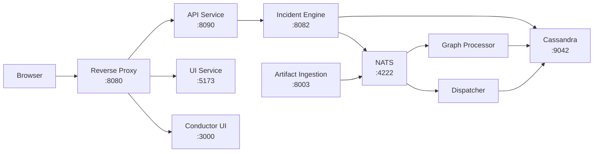

# Architecture

WitFoo Analytics is a microservices-based platform built on Go, SvelteKit, Cassandra, and NATS.

## Service Architecture

## Services

| Service | Port | Description |
| --- | --- | --- |
| Reverse Proxy | 8080 | Routes browser requests to API, UI, and Conductor UI |
| API | 8090 | REST API gateway — proxies to Incident Engine |
| Incident Engine | 8082 | Core business logic, domain operations, Cassandra access |
| UI | 5173 | SvelteKit frontend with Carbon Components |
| Artifact Ingestion | 8003 | Receives security artifacts via HTTP, publishes to NATS |
| Graph Processor | — | Consumes NATS events, builds node/edge graph in Cassandra |
| Dispatcher | — | Processes NATS events for incident correlation |
| Cassandra | 9042 | Primary data store |
| NATS | 4222 | Message broker for event-driven processing |

## Data Flow

!!! info "Coming Soon"
    Detailed architecture documentation including deployment topologies,
    scaling patterns, and high-availability configuration will be
    auto-generated from the WitFoo Analytics codebase on the next release.
