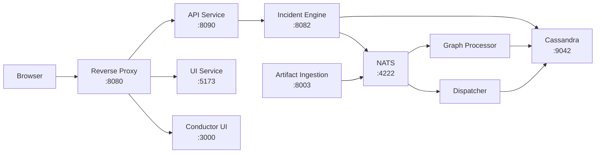
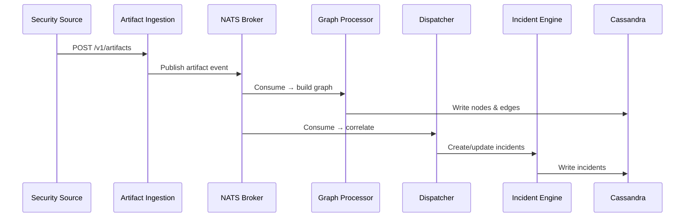

# Architecture

WitFoo Analytics is a microservices platform built on Go, SvelteKit, Apache Cassandra, and NATS messaging.

## Service Architecture



## Services

| Service | Port | Technology | Description |
| --- | --- | --- | --- |
| Reverse Proxy | 8080 | Go / Gin | Routes browser requests to API, UI, and Conductor UI |
| API | 8090 | Go / Gin | REST API gateway — proxies requests to Incident Engine |
| Incident Engine | 8082 | Go / Gin | Core business logic, domain operations, Cassandra access |
| UI | 5173 | SvelteKit 5 | Frontend with Carbon Components for IBM design system |
| Artifact Ingestion | 8003 | Go | Receives security artifacts via HTTP, publishes to NATS |
| Graph Processor | — | Go | Consumes NATS events, builds node/edge graph in Cassandra |
| Dispatcher | — | Go | Processes NATS events for incident correlation and analysis |
| Cassandra | 9042 | Apache Cassandra | Primary data store for all persistent data |
| NATS | 4222 | NATS Server | Message broker for event-driven processing |

## Data Flow

Security artifacts flow through the system in a pipeline:



### Processing Steps

1. **Ingestion** — External sources send artifacts (logs, alerts, events) to the Artifact Ingestion service via HTTP POST
2. **Publishing** — Artifacts are published to NATS topics for parallel processing
3. **Graph Building** — The Graph Processor creates nodes (IPs, domains, users) and edges (relationships) in Cassandra
4. **Correlation** — The Dispatcher groups related artifacts into incidents based on shared nodes and timing
5. **Analysis** — The Incident Engine evaluates incidents against lead rules and classification rules
6. **Storage** — All processed data is persisted in Cassandra for querying via the API

## API Flow

Browser requests follow this path:

```text
Browser → Reverse Proxy (:8080) → API (:8090) → Incident Engine (:8082) → Cassandra
```

The API service acts as a gateway, adding authentication (JWT), authorization (permission checks), and request routing. The Incident Engine contains all business logic and direct database access.

## Technology Stack

| Layer | Technology |
| --- | --- |
| Frontend | SvelteKit 5, Carbon Components Svelte, TypeScript |
| API Gateway | Go, Gin framework |
| Business Logic | Go, Gin framework |
| Database | Apache Cassandra 4.x |
| Messaging | NATS 2.x |
| Containerization | Docker, Docker Compose |
| Authentication | JWT (HS256) |
| Fonts | IBM Plex Sans, IBM Plex Mono |
