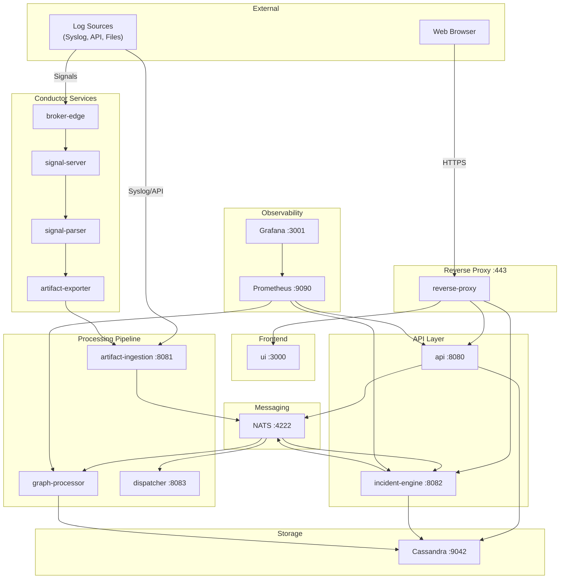
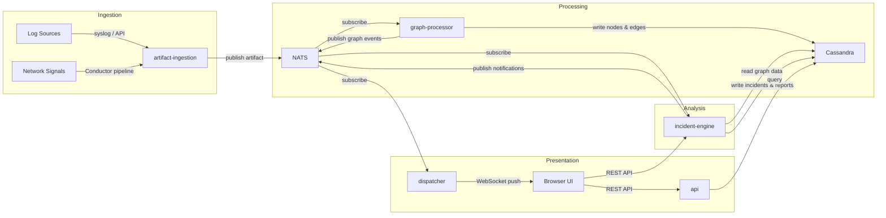

# Architecture

WitFoo Analytics is built on a microservices architecture where each service handles a specific function in the security data pipeline. Services communicate via NATS messaging and HTTP APIs, with Apache Cassandra providing persistent storage.

## Service Architecture

The following diagram shows the core services and their relationships:

## Core Services

| Service | Port | Description |
|---------|------|-------------|
| **reverse-proxy** | 443 | TLS termination, routes requests to UI and API services |
| **ui** | 3000 | Svelte 5 web application served to the browser |
| **api** | 8080 | REST API for authentication, graph queries, and configuration |
| **incident-engine** | 8082 | Incident detection, analysis, reporting, and compliance scoring |
| **artifact-ingestion** | 8081 | Receives and normalizes security artifacts from log sources |
| **graph-processor** | — | Builds knowledge graphs from ingested artifacts via NATS |
| **dispatcher** | 8083 | WebSocket service for real-time UI updates |
| **NATS** | 4222 | Message broker for inter-service communication |
| **Cassandra** | 9042 | Distributed database for artifacts, graphs, incidents, and reports |
| **Prometheus** | 9090 | Metrics collection and alerting |
| **Grafana** | 3001 | Metrics visualization dashboards |

### Conductor Services

These services are present when the appliance role includes Conductor functionality:

| Service | Description |
|---------|-------------|
| **broker-edge** | Receives signals from network sensors and endpoints |
| **signal-server** | Manages signal routing and deduplication |
| **signal-parser** | Parses raw signals into structured artifacts |
| **artifact-exporter** | Forwards parsed artifacts to the ingestion pipeline |

## Data Flow

The following diagram illustrates how security data moves through the platform from ingestion to incident response:

### Data Flow Summary

1. **Ingestion** — Security artifacts arrive from log sources (syslog, REST API, file upload) or through the Conductor signal pipeline. The artifact-ingestion service normalizes incoming data and publishes it to NATS.

2. **Graph Processing** — The graph-processor subscribes to artifact events, extracts entities (IP addresses, domains, users, hashes), and builds a knowledge graph in Cassandra with nodes, edges, and relationships.

3. **Incident Analysis** — The incident-engine subscribes to graph events, applies detection rules and observation logic, correlates related artifacts into incidents, and generates compliance reports.

4. **Presentation** — The dispatcher pushes real-time updates to the browser via WebSocket. The UI queries the API and incident-engine for dashboards, search results, and reports.

## Network Ports

| Port | Protocol | Service | Direction |
|------|----------|---------|-----------|
| 443 | HTTPS | reverse-proxy | Inbound — browser access |
| 22 | SSH | OS | Inbound — administration |
| 514 | TCP/UDP | artifact-ingestion | Inbound — syslog sources |
| 8080 | HTTP | api | Internal |
| 8081 | HTTP | artifact-ingestion | Internal |
| 8082 | HTTP | incident-engine | Internal |
| 8083 | HTTP/WS | dispatcher | Internal |
| 4222 | TCP | NATS | Internal |
| 9042 | TCP | Cassandra | Internal (or clustered) |
| 9090 | HTTP | Prometheus | Internal |
| 3001 | HTTP | Grafana | Internal |

!!! tip "Firewall Configuration"
    For a single-node deployment, only ports **443** (HTTPS) and **22** (SSH) need to be open to external traffic. All other ports are used for internal service-to-service communication. For clustered deployments, Cassandra port **9042** must be open between data nodes.

## Storage Architecture

WitFoo Analytics uses Apache Cassandra as its primary data store. Data is organized into the following categories:

| Data Category | Description | Default Retention |
|--------------|-------------|-------------------|
| Artifacts | Raw and normalized security events | 7 days |
| Graph Nodes & Edges | Knowledge graph entities and relationships | 7 days |
| Work Units | Individual investigation tasks | 365 days |
| Work Collections | Grouped investigations (incidents) | 365 days |
| Reports | Compliance and operational reports | 1,825 days (5 years) |

Retention periods are configurable during the setup wizard or via `sudo wfa configure`.