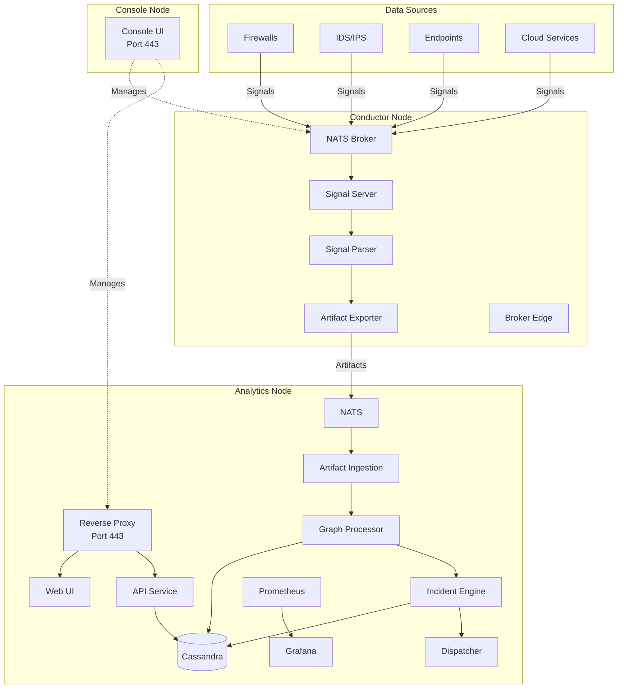
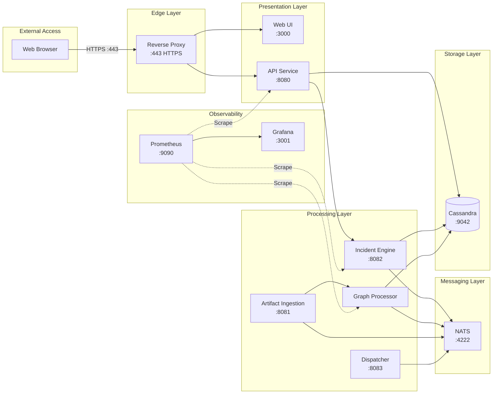
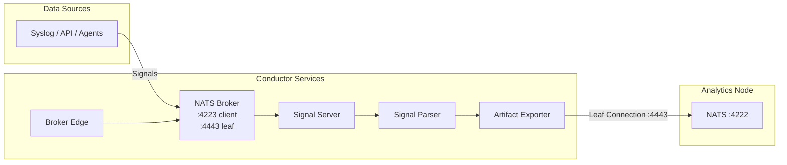
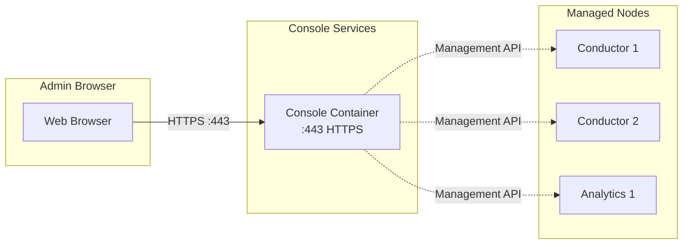
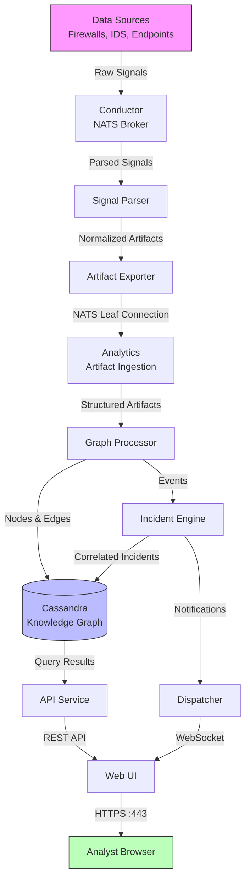

# Architecture

WitFoo Analytics uses a distributed, containerized architecture where each node role runs a specific set of services. This page describes the service architecture, inter-node communication, and data flow.

## Deployment Topology

A complete WitFoo Analytics deployment consists of up to three node roles working together:

## Service Architecture — Analytics Node

The Analytics node is the primary platform, running all services required for investigation, correlation, and reporting.

### Analytics Services

| Service | Port | Description |
|---------|------|-------------|
| Reverse Proxy | 443 | TLS termination, routes requests to UI and API |
| Web UI | 3000 | Svelte-based user interface |
| API Service | 8080 | REST API, authentication, RBAC |
| Incident Engine | 8082 | Incident correlation, scoring, status management |
| Graph Processor | — | Builds and maintains the security knowledge graph |
| Artifact Ingestion | 8081 | Receives and normalizes incoming artifacts |
| Dispatcher | 8083 | WebSocket notifications and real-time event delivery |
| NATS | 4222 | Internal message bus for service communication |
| Cassandra | 9042 | Primary data store for all analytics data |
| Prometheus | 9090 | Metrics collection (bound to localhost) |
| Grafana | 3001 | Metrics visualization dashboards |

## Service Architecture — Conductor Node

The Conductor node handles data ingestion from remote networks and forwards processed signals to the Analytics node.

### Conductor Services

| Service | Port | Description |
|---------|------|-------------|
| NATS Broker | 4223 (client), 4443 (leaf) | Message broker for signal ingestion and forwarding |
| Signal Server | — | Receives raw signals from data sources |
| Signal Parser | — | Parses and normalizes signals into structured artifacts |
| Artifact Exporter | — | Forwards processed artifacts to the Analytics node |
| Broker Edge | — | Manages broker cluster connectivity |

## Service Architecture — Console Node

The Console node is a lightweight management interface for monitoring and configuring remote Conductor and Analytics nodes.

### Console Services

| Service | Port | Description |
|---------|------|-------------|
| Console | 443 | Single-container management UI and API |

## Data Flow

The following diagram shows how security data flows from ingestion to investigation:

### Data Flow Summary

1. **Ingestion** — Data sources send raw signals (syslog, API, agents) to the Conductor's NATS broker.
2. **Parsing** — The Signal Server and Signal Parser normalize raw signals into structured artifacts.
3. **Export** — The Artifact Exporter forwards normalized artifacts to the Analytics node via a NATS leaf connection.
4. **Processing** — Artifact Ingestion receives artifacts and passes them to the Graph Processor, which builds a security knowledge graph in Cassandra.
5. **Correlation** — The Incident Engine analyzes graph data to detect, score, and correlate security incidents.
6. **Notification** — The Dispatcher delivers real-time updates to connected web UI sessions via WebSocket.
7. **Investigation** — Analysts access the platform through the web UI (HTTPS on port 443), querying the API for incidents, graph data, and reports.

## Network Ports

| Port | Protocol | Service | Direction | Description |
|------|----------|---------|-----------|-------------|
| 443 | HTTPS | Reverse Proxy / Console | Inbound | Web UI and API access |
| 4223 | TCP | NATS Broker (Conductor) | Inbound | Signal ingestion from data sources |
| 4443 | TCP | NATS Broker (Conductor) | Inbound/Outbound | Leaf node connections to Analytics |
| 9042 | TCP | Cassandra | Internal | Database communication (not exposed externally) |
| 4222 | TCP | NATS (Analytics) | Internal | Internal message bus |

!!! tip "Minimal Firewall Configuration"
    For a single Analytics node deployment, only port **443** needs to be open to users. Ports 4223 and 4443 are only required when deploying Conductor nodes for remote data collection.