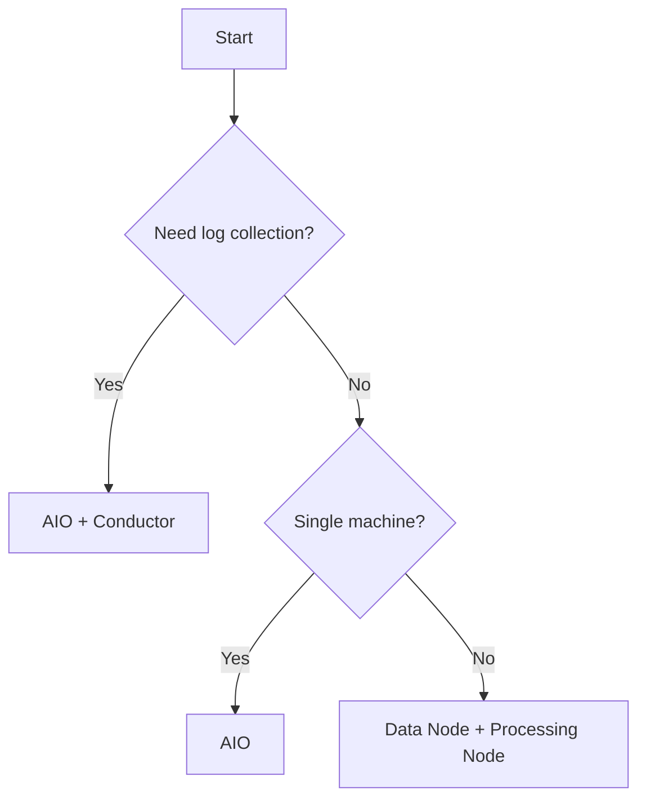

# Deployment Roles

WitFoo Analytics supports four deployment roles, each designed for different environments and scale requirements.

## Role Overview

| Role | Services | Use Case |
| --- | --- | --- |
| AIO + Conductor | All services + signal pipeline | Full deployment with log collection |
| AIO | All analytics services | Standalone analytics without log collection |
| Data Node | Cassandra only | Dedicated database nodes for clustering |
| Processing Node | Processing services | Dedicated compute for artifact processing |

## AIO + Conductor

The most complete deployment — runs all analytics services plus the Conductor signal pipeline for collecting logs from your infrastructure.

**Services included:**

- All analytics services (API, Incident Engine, UI, Cassandra, NATS, etc.)
- Conductor signal server (syslog, Beats)
- Conductor signal parser and artifact filter
- Conductor artifact exporter (sends to Artifact Ingestion)

**Hardware requirements:**

| Resource | Minimum | Recommended |
| --- | --- | --- |
| CPU | 8 cores | 16 cores |
| RAM | 16 GB | 32 GB |
| Disk | 100 GB SSD | 500 GB SSD |

```bash
# Deploy with WFA CLI
wfa analytics install --role aio-conductor

# Or with Docker Compose
docker compose -f docker/docker-compose.aio-conductor.yml up -d
```

## AIO (All-in-One)

Runs all analytics services on a single machine without the Conductor signal pipeline. Use this when you have an existing log collection infrastructure.

**Hardware requirements:**

| Resource | Minimum | Recommended |
| --- | --- | --- |
| CPU | 4 cores | 8 cores |
| RAM | 8 GB | 16 GB |
| Disk | 50 GB SSD | 200 GB SSD |

```bash
# Deploy with WFA CLI
wfa analytics install --role aio

# Or with Docker Compose
docker compose -f docker/docker-compose.aio.yml up -d
```

## Data Node

A dedicated Cassandra database node for distributed deployments. Data nodes store all persistent data and can be clustered for high availability.

**Hardware requirements:**

| Resource | Minimum | Recommended |
| --- | --- | --- |
| CPU | 4 cores | 8 cores |
| RAM | 8 GB | 16 GB |
| Disk | 200 GB SSD | 1 TB SSD |

```bash
wfa analytics install --role data-node
```

!!! info "Clustering"
    Multiple data nodes form a Cassandra cluster. Configure `DATA_NODE_HOSTS` on processing nodes to point to your data node addresses.

## Processing Node

Runs compute-intensive services without a local Cassandra instance. Processing nodes connect to external data nodes.

**Hardware requirements:**

| Resource | Minimum | Recommended |
| --- | --- | --- |
| CPU | 4 cores | 8 cores |
| RAM | 8 GB | 16 GB |
| Disk | 50 GB SSD | 100 GB SSD |

```bash
export DATA_NODE_HOSTS="data-node-1:9042,data-node-2:9042"
wfa analytics install --role processing-node
```

## Choosing a Role



!!! tip "Start with AIO"
    If unsure, start with the AIO role. You can migrate to a distributed topology later by adding data nodes and processing nodes.
