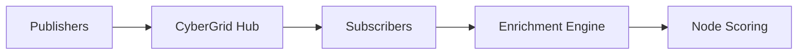

# CyberGrid

CyberGrid is WitFoo Analytics' threat intelligence sharing platform. Subscribe to curated feeds, publish indicators, and enrich security data with community intelligence.

## Components

### [Subscriptions](subscriptions.md)

Subscribe to threat intelligence feeds. Indicators are automatically used for artifact enrichment.

### [Publications](publications.md)

Share your organization's threat indicators with the CyberGrid community.

### [Jobs](jobs.md)

Monitor synchronization jobs for feed downloads, processing, and uploads.

### [Library](library.md)

Browse available feeds and manage your intelligence library.

## How CyberGrid Works

## Permissions

| Action | Required Permission |
| --- | --- |
| View CyberGrid | `cybergrid:read` |
| Manage subscriptions | `cybergrid:write` |
| Publish indicators | `cybergrid:manage` |
