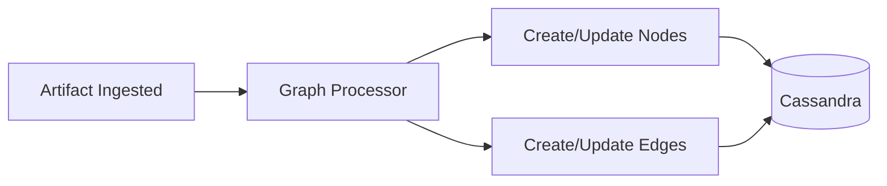

# Graph

The Graph module visualizes the relationship network built from correlated security artifacts. As artifacts are ingested, the Graph Processor extracts entities (nodes) and identifies relationships (edges) between them, forming a queryable knowledge graph stored in Cassandra.

## How the Graph Works

1. **Artifact ingestion** — Security events arrive via the Artifact Ingestion service
2. **Entity extraction** — The Graph Processor identifies entities: IP addresses, domains, users, hostnames, hashes
3. **Node creation** — Each unique entity becomes a node with properties and classification flags
4. **Edge creation** — Relationships between entities become edges with timestamps and metadata
5. **Correlation** — The Dispatcher uses the graph to group related artifacts into incidents

## Graph Entities

### [Nodes](nodes.md)

Nodes represent distinct entities observed in your security data. Each node has a type, value, and set of classification flags (managed, internal, trusted, infrastructure).

### [Edges](edges.md)

Edges represent observed relationships between nodes. Each edge records the relationship type, first/last seen timestamps, and the artifacts that created the relationship.

## Node Classification

Nodes are automatically classified using framework-based rules:

| Flag | Meaning |
| --- | --- |
| **Managed** | Entity is under your organization's management |
| **Internal** | Entity is within your network boundary |
| **Trusted** | Entity is known-good and trusted |
| **Infrastructure** | Entity is an infrastructure device (router, switch, firewall) |

These flags are used by classification rules to determine incident severity and by compliance calculations for focus-based scoring.
