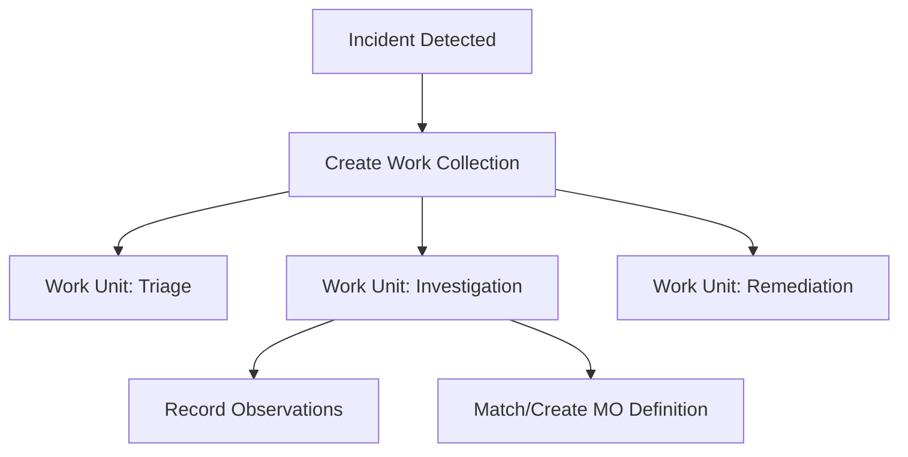

# Observer

The Observer module tracks analyst work and captures institutional knowledge about security operations. It provides structured workflows for documenting investigations, defining threat patterns, and recording observations.

## Components

### [Work Units](work-units.md)

Individual tasks or investigation steps performed by analysts. Work units track time spent, status, and outcomes for each piece of security work.

### [Work Collections](work-collections.md)

Groups of related work units organized into logical investigations. Work collections aggregate time and effort across multiple tasks.

### [MO Definitions](mo-definitions.md)

Modus operandi (MO) definitions describe known attack patterns and threat behaviors. Analysts create MO definitions to codify institutional knowledge about recurring threats.

### [Observations](observations.md)

Freeform notes and findings recorded during investigations. Observations capture context that doesn't fit into structured fields — analyst insights, external research, and contextual notes.

## Workflow

1. An incident triggers a new **work collection**
2. Analysts create **work units** for each investigation step
3. During investigation, analysts record **observations** and match to known **MO definitions**
4. Work collection aggregates total effort for reporting

## Permissions

| Action | Required Permission |
| --- | --- |
| View observer data | `observer:read` |
| Create/edit work items | `observer:write` |
| Manage MO definitions | `observer:manage` |
