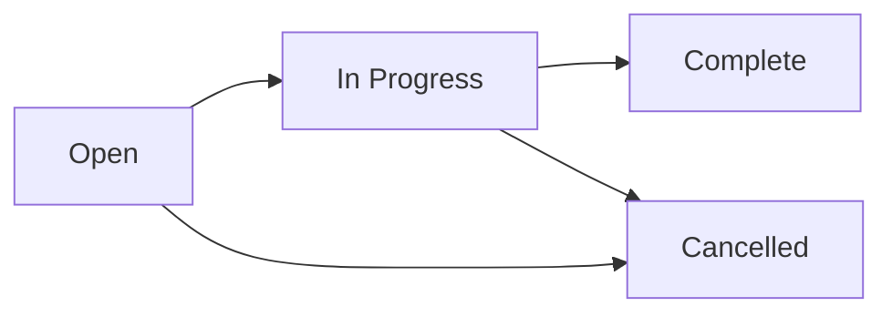

# Work Units

Work units represent individual tasks or investigation steps performed by security analysts. Each work unit tracks what was done, who did it, and how long it took.

## Work Unit Properties

| Field | Description |
| --- | --- |
| **Title** | Short description of the task |
| **Description** | Detailed explanation of work performed |
| **Assignee** | Analyst responsible for the work |
| **Status** | Current state (Open, In Progress, Complete, Cancelled) |
| **Priority** | Task priority (Low, Medium, High, Critical) |
| **Time spent** | Hours invested in this task |
| **Related incident** | Link to the associated incident (optional) |
| **Work collection** | Parent collection grouping related units |
| **Created/Updated** | Timestamps for tracking |

## Creating Work Units

1. Navigate to **Observer** > **Work Units**
2. Click **Create Work Unit**
3. Fill in the title, description, and assignee
4. Optionally link to an incident or work collection
5. Click **Save**

Work units can also be created directly from an incident detail page.

## Status Workflow

## Time Tracking

Time spent on work units feeds into the Reporter module's cost/savings analysis. The total investigation time across all work units contributes to:

- **FTE calculations** — How many full-time analysts are needed
- **Cost per incident** — Average cost based on analyst hourly rates
- **Savings analysis** — Time saved through automation vs manual investigation

## Filtering and Search

Filter work units by:

- Assignee
- Status
- Priority
- Date range
- Associated incident or work collection
