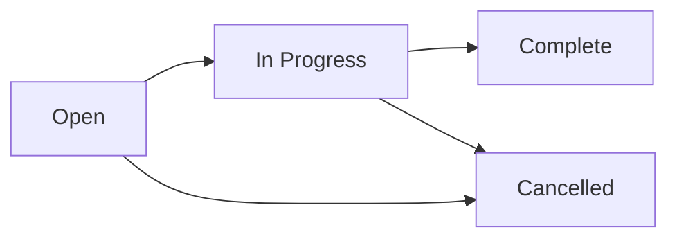

# Work Units

Work units represent individual tasks or investigation steps performed by security analysts. Each work unit tracks what was done, who did it, and how long it took.

## Work Unit Properties

| Field | Description |
| --- | --- |
| **Title** | Short description of the task |
| **Description** | Detailed explanation of work performed |
| **Assignee** | Analyst responsible for the work |
| **Status** | Current state (Open, In Progress, Complete, Cancelled) |
| **Priority** | Task priority (Low, Medium, High, Critical) |
| **Time spent** | Hours invested in this task |
| **Related incident** | Link to the associated incident (optional) |
| **Work collection** | Parent collection grouping related units |
| **Created/Updated** | Timestamps for tracking |

## Creating Work Units

1. Navigate to **Observer** > **Work Units**
2. Click **Create Work Unit**
3. Fill in the title, description, and assignee
4. Optionally link to an incident or work collection
5. Click **Save**

Work units can also be created directly from an incident detail page.

## Work Unit Detail Layout

The work unit detail view uses a consolidated **5-tab layout** that groups related information for efficient investigation workflows.

### Overview Tab

The default view showing the work unit's core properties, status, assignee, priority, and suspicion score breakdown. Includes the composite scoring panel with component weights (Robust Node, MO Coverage, Alarm Density, Entity Diversity) and outlier detection indicators.

### Graph Tab

Interactive Cytoscape graph visualization of the work unit's nodes and edges. Displays entity relationships, node types (IPs, domains, users, hostnames), and connection patterns. Supports drill-down into individual node and edge details.

### Signals Tab

Consolidates signal-related content using an **Accordion** pattern to organize sub-sections within a single tab:

- **Artifacts** — Raw security artifacts associated with the work unit
- **Lead Rules** — Lead rules that fired to create or contribute to this work unit
- **ATT&CK Techniques** — MITRE ATT&CK techniques and sub-techniques mapped to observed behaviors
- **Observations** — Analyst observations and MO definition matches

!!! tip "Accordion Pattern"
    The Signals tab uses expandable Accordion sections to consolidate what were previously separate tabs into a single scrollable view. Each section can be expanded or collapsed independently, allowing analysts to focus on the most relevant data without switching between tabs.

### Timeline Tab

Chronological event timeline showing the progression of activity related to the work unit. Displays artifact timestamps, status changes, and analyst actions in order.

### Notes/Tasks Tab

Collaboration space for analyst notes, task assignments, and investigation documentation. Supports markdown formatting and integrates with the chat system for team discussions.

## Status Workflow

```mermaid
graph LR
    O[Open] --> IP[In Progress]
    IP --> C[Complete]
    IP --> X[Cancelled]
    O --> X
```

## Time Tracking

Time spent on work units feeds into the Reporter module's cost/savings analysis. The total investigation time across all work units contributes to:

- **FTE calculations** — How many full-time analysts are needed
- **Cost per incident** — Average cost based on analyst hourly rates
- **Savings analysis** — Time saved through automation vs manual investigation

## Filtering and Search

Filter work units by:

- Assignee
- Status
- Priority
- Date range
- Associated incident or work collection
