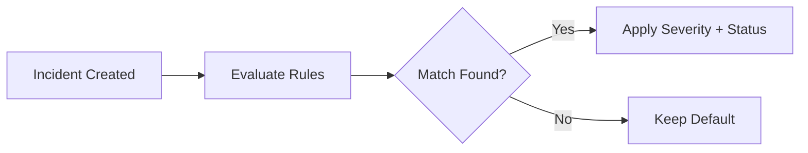

# Classification Rules

Classification rules automatically assign severity and status to incidents based on matching criteria. They run after lead rules create incidents, evaluating node properties, artifact types, and graph relationships.

## How Classification Works

When an incident is created or updated, the classification engine evaluates all enabled rules in priority order. The first matching rule sets the incident's severity and status.

## Rule Properties

| Field | Description |
| --- | --- |
| **Name** | Human-readable rule identifier |
| **Priority** | Evaluation order (lower = higher priority) |
| **Enabled** | Whether the rule is active |
| **Severity** | Severity to assign on match (Critical, High, Medium, Low, Info) |
| **Status** | Status to assign on match |
| **Target Infrastructure** | When enabled, rule only matches infrastructure-flagged nodes |

## Conditions

Rules can match on:

- **Node types** — IP addresses, domains, users, hostnames
- **Node flags** — Managed, internal, trusted, infrastructure
- **Artifact sources** — Specific security products or log sources
- **Framework controls** — Nodes associated with specific compliance controls
- **Lead rule matches** — Incidents created by specific lead rules

## Managing Rules

### Create a Rule

1. Navigate to **Signals** > **Classification Rules**
2. Click **Create Rule**
3. Configure the matching conditions and assignment values
4. Set the priority relative to existing rules
5. Click **Save**

### Edit or Disable

Click a rule in the table to edit its properties. Toggle the **Enabled** switch to activate or deactivate a rule without deleting it.

!!! tip "Rule Priority"
    Rules evaluate in priority order. Place more specific rules at higher priority (lower number) than general catch-all rules.

## Permissions

| Action | Required Permission |
| --- | --- |
| View rules | `signals:read` |
| Create/edit rules | `signals:write` |
| Delete rules | `signals:manage` |
