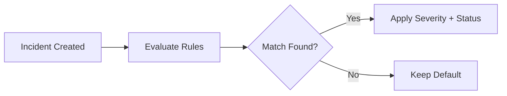

# Classification Rules

Classification rules automatically assign severity and status to incidents based on matching criteria. They run after lead rules create incidents, evaluating node properties, artifact types, and graph relationships.

## How Classification Works

When an incident is created or updated, the classification engine evaluates all enabled rules in priority order. The first matching rule sets the incident's severity and status.

```mermaid
graph LR
    I[Incident Created] --> E[Evaluate Rules]
    E --> M{Match Found?}
    M -->|Yes| A[Apply Severity + Status]
    M -->|No| D[Keep Default]
```

## Rule Properties

| Field | Description |
| --- | --- |
| **Name** | Human-readable rule identifier |
| **Priority** | Evaluation order (lower = higher priority) |
| **Enabled** | Whether the rule is active |
| **Severity** | Severity to assign on match (Critical, High, Medium, Low, Info) |
| **Status** | Status to assign on match |
| **Target Infrastructure** | When enabled, rule only matches infrastructure-flagged nodes |

## Conditions

Rules can match on:

- **Node types** — IP addresses, domains, users, hostnames
- **Node flags** — Managed, internal, trusted, infrastructure
- **Artifact sources** — Specific security products or log sources
- **Framework controls** — Nodes associated with specific compliance controls
- **Lead rule matches** — Incidents created by specific lead rules

## Managing Rules

The Classification Rules page provides full CRUD (Create, Read, Update, Delete) operations through a dedicated management interface.

### Create a Rule

1. Navigate to **Signals** > **Classification Rules**
2. Click **Create Rule**
3. Configure the matching conditions and assignment values
4. Set the priority relative to existing rules
5. Click **Save**

### Edit or Disable

Click a rule in the table to edit its properties. Toggle the **Enabled** switch to activate or deactivate a rule without deleting it.

### Delete a Rule

Select a rule and click **Delete** to permanently remove it. Deletion does not retroactively change incidents that were previously classified by the rule.

!!! tip "Rule Priority"
    Rules evaluate in priority order. Place more specific rules at higher priority (lower number) than general catch-all rules.

### Rule Criteria Syntax

Rule conditions use a criteria expression format with field-operator-value triples:

| Operator | Description | Example |
| --- | --- | --- |
| `eq` | Equals | `node_type eq "ip_address"` |
| `ne` | Not equals | `status_id ne 5` |
| `gte` | Greater than or equal | `suspicion_score gte 0.50` |
| `lte` | Less than or equal | `priority lte 2` |
| `contains` | String contains | `source contains "firewall"` |
| `in` | Value in list | `node_type in ["ip_address", "domain"]` |

Multiple conditions are combined with `AND` logic -- all conditions must match for the rule to apply.

## How Rules Are Applied

Classification rules run automatically when signals are ingested and processed:

1. **Ingestion** — New artifacts arrive via the artifact-ingestion service
2. **Lead rule evaluation** — Lead rules fire to create or update incidents
3. **Classification** — Enabled classification rules evaluate in priority order against the resulting incident
4. **Assignment** — The first matching rule sets the severity and status

Rules are re-evaluated when incident properties change (e.g., new artifacts are added or graph relationships update).

## Permissions

| Action | Required Permission |
| --- | --- |
| View rules | `signals:read` |
| Create/edit rules | `signals:write` |
| Delete rules | `signals:manage` |
